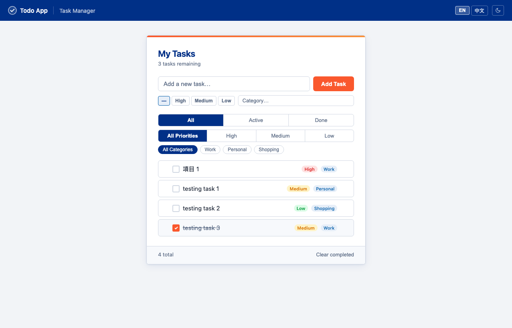

# Vide Learning — Todo App

A clean, modern task manager built with vanilla HTML/CSS/JS and a Node.js backend. No frameworks, no dependencies — just Node.js built-ins.



---

## Features

| Feature | Description |
|---|---|
| **Priority badges** | Tag tasks as High / Medium / Low; color-coded red / amber / green. Click any badge to cycle through priorities. |
| **Category tags** | Label tasks with a category (Work, Personal, etc.). Click a tag inline to edit or reassign it. |
| **Shared categories** | Custom categories are saved server-side (`categories.json`) — visible to every browser and device that accesses the app. |
| **Drag-and-drop reorder** | Hover a task to reveal the `⠿` handle, then drag it to any position in the list. |
| **Filters** | Filter by status (All / Active / Done), by priority, and by category chip. |
| **Dark / light mode** | Toggle in the nav bar; preference remembered in `localStorage`. |
| **Language switching** | English and Traditional Chinese (繁體中文), switchable in the nav bar. |
| **Persistent storage** | Tasks saved to `tasks.json`; categories saved to `categories.json` — no database required. |

---

## Prerequisites

- [Node.js](https://nodejs.org/) v14 or later
- No `npm install` needed — the server uses only Node.js built-in modules

---

## Installation

```bash
# 1. Clone the repository
git clone https://github.com/jlohomelab/vide-learning-todo-app.git
cd vide-learning-todo-app

# 2. Start the server
node server.js
```

Then open **http://localhost:3000** in your browser.

> **Note:** Do not open `index.html` directly — the app requires the Node.js server to load and save tasks.

---

## Usage

### Adding a task

1. Type your task in the input field at the top.
2. Optionally select a **priority** (High / Medium / Low) using the buttons below the input.
3. Optionally type or select a **category** from the dropdown.
4. Press **Enter** or click **Add Task**.

### Editing priority or category

- **Priority** — click the colored badge on any task to cycle through High → Medium → Low → none.
- **Category** — click the category tag (or the `＋` that appears on hover for uncategorised tasks) to open an inline editor. Press **Enter** or click away to save.

### Reordering tasks

Hover a task to reveal the `⠿` drag handle on the left, then drag the task to the desired position.

### Filtering

- Use the **All / Active / Done** tabs to filter by completion status.
- Use the **All Priorities / High / Medium / Low** tabs to filter by priority.
- Click a **category chip** (appears below the priority filters once categories are in use) to show only tasks in that category.

### Dark mode & language

Use the buttons in the top-right of the nav bar to toggle dark/light mode or switch between English and Traditional Chinese.

---

## Project Structure

```
vide-learning-todo-app/
├── index.html        # Frontend UI (served by the backend)
├── server.js         # Node.js HTTP server
├── categories.json   # Persistent category list (auto-created on first run)
├── tasks.csv         # Persistent task storage (auto-created on first run, git-ignored)
└── CLAUDE.md         # Developer notes and API reference
```

### tasks.json format

```json
[
  { "id": 1726123456789, "text": "Buy groceries", "done": false, "priority": "high", "category": "Work" },
  { "id": 1726123456000, "text": "Call dentist",  "done": true,  "priority": "",     "category": "" }
]
```

If a legacy `tasks.csv` file exists, the server automatically migrates it to `tasks.json` on first start.

### API routes

| Method | Path | Description |
|---|---|---|
| `GET` | `/` | Serves `index.html` |
| `GET` | `/api/tasks` | Returns all tasks as JSON |
| `POST` | `/api/tasks` | Overwrites `tasks.csv` with the posted JSON array |
| `GET` | `/api/categories` | Returns all category names as JSON |
| `POST` | `/api/categories` | Appends a new category `{ name }` and returns the updated list |

---

## Tech Stack

- **Frontend** — Vanilla HTML, CSS (custom properties for theming), JavaScript (no frameworks)
- **Backend** — Node.js built-in `http`, `fs`, `path` modules only
- **Storage** — CSV file for tasks, JSON file for categories
- **Design** — Navy (`#003087`) and orange (`#FA582D`) color palette with CSS custom properties for theming

---

## License

MIT
